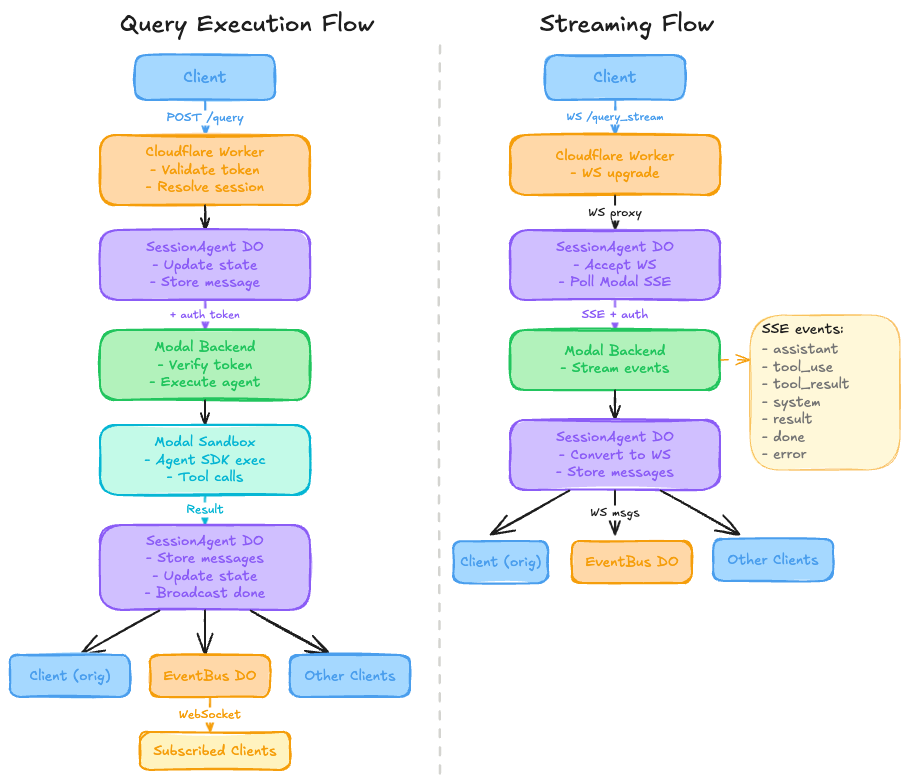

# Rafiki (Modal + OpenAI Agents SDK)

<!-- ⚠️ WARNING: This project is experimental. Features and behavior may change without warning. -->


Rafiki is a production ready agent harness: the operational shell that makes an agent executable, stateful, secure, routable, and observable in production.
Cloudflare Workers + Durable Objects provide the public control plane, while Modal runs the internal execution backend for the current OpenAI Agents SDK-based runtime.
The harness remains the stable system boundary even if the underlying agent loop changes.
This project was inspired by Ramp's blog post, [Why we built our background agent](https://builders.ramp.com/post/why-we-built-our-background-agent).

## System Boundary

- Public client ingress: Cloudflare Worker + Durable Objects.
- Internal gateway: Modal `http_app`, called by the Worker or by local/operator diagnostics.
- Execution runtime: the long-lived controller sandbox in `modal_backend/api/controller.py`.
- Direct Modal gateway access is not the supported client path; non-health Modal endpoints require internal auth.

## Setup

```bash
source .venv/bin/activate
uv sync
uv run pre-commit install

# Modal auth + required API secret
pip install modal
modal setup
modal secret create openai-secret OPENAI_API_KEY=<your-key>
```

## Quickstart

### Local Modal smoke check

```bash
modal run -m modal_backend.main
modal run -m modal_backend.main::run_agent_remote --question "Explain REST vs gRPC"
```

### Local service mode

```bash
modal serve -m modal_backend.main
# or
make serve
```

### Deploy Internal Modal Backend

```bash
modal deploy -m modal_backend.deploy
```

## Cloudflare Control Plane (Required for Client Traffic)

```bash
cd edge-control-plane
npm install
wrangler login
wrangler secret put MODAL_TOKEN_ID
wrangler secret put MODAL_TOKEN_SECRET
wrangler secret put INTERNAL_AUTH_SECRET
wrangler secret put SESSION_SIGNING_SECRET
wrangler kv:namespace create SESSION_CACHE
npm run deploy
```

The Worker also depends on matching Modal-side auth secrets:

```bash
modal secret create internal-auth-secret INTERNAL_AUTH_SECRET=<same-as-cloudflare>
modal secret create modal-auth-secret \
  SANDBOX_MODAL_TOKEN_ID=<token-id> \
  SANDBOX_MODAL_TOKEN_SECRET=<token-secret>
```

For the canonical setup and verification flow, start with `docs/references/runbooks/cloudflare-modal-e2e.md` and `edge-control-plane/README.md`.

## Query Execution Flow



## Common Ops

```bash
# Terminate background sandbox
modal run -m modal_backend.main::terminate_service_sandbox

# Snapshot service filesystem
modal run -m modal_backend.main::snapshot_service

# Run tests
uv run pytest
```

## Docs

- `docs/design-docs/cloudflare-hybrid-architecture.md` - public control plane and system boundary
- `docs/design-docs/architecture-overview.md` - architecture overview
- `docs/design-docs/multi-agent-architecture.md` - agent types + orchestration
- `docs/design-docs/controllers-background-service.md` - background service
- `docs/references/api-usage.md` - endpoints and auth
- `docs/references/configuration.md` - settings
- `docs/references/tool-development.md` - tool development
- `docs/references/troubleshooting.md` - common issues
- `docs/references/runtime-docs-overview.md` - doc index

## Links

- [Modal Documentation](https://modal.com/docs)
- [OpenAI Agents Python Documentation](https://openai.github.io/openai-agents-python/)
- [FastAPI Documentation](https://fastapi.tiangolo.com/)
