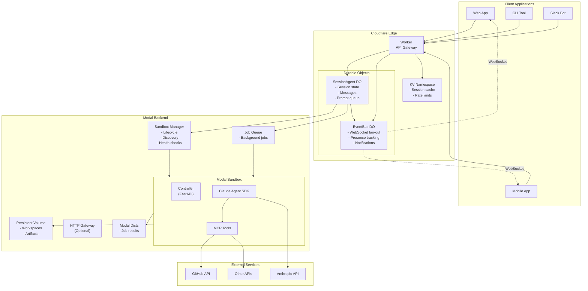
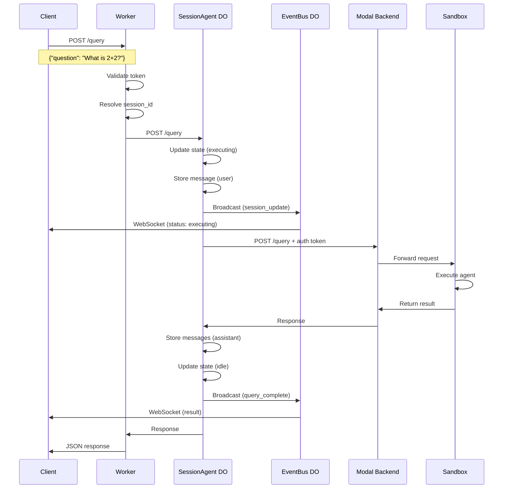
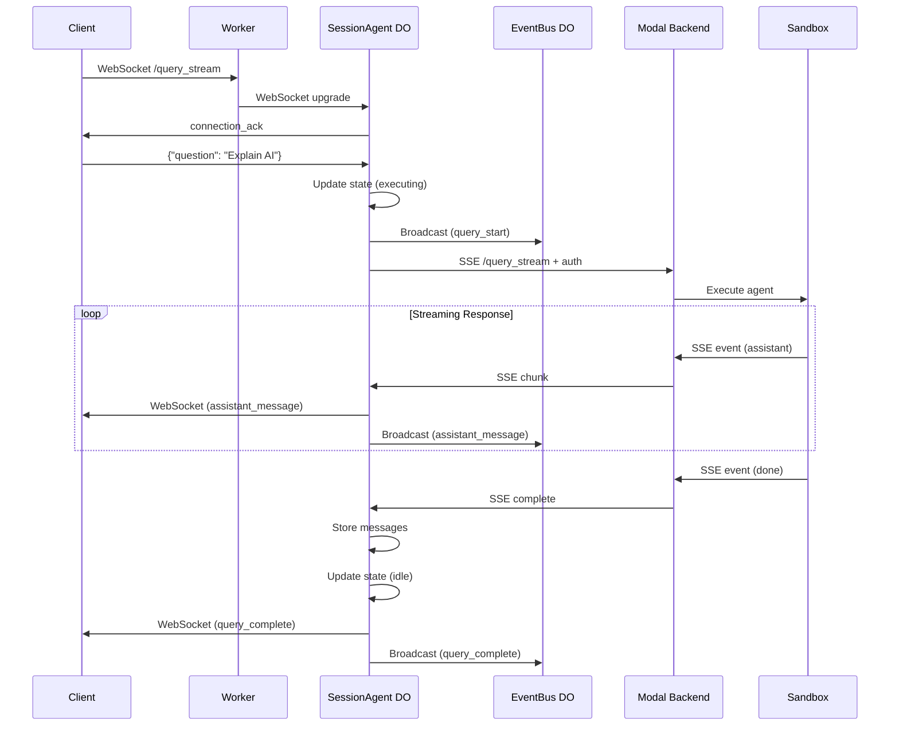
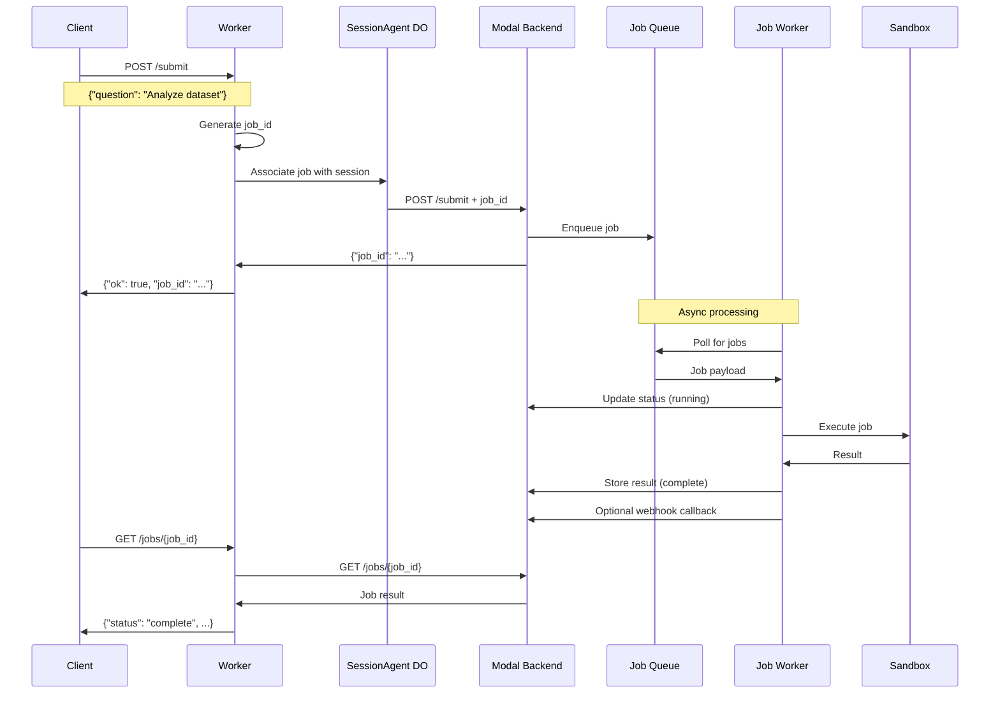
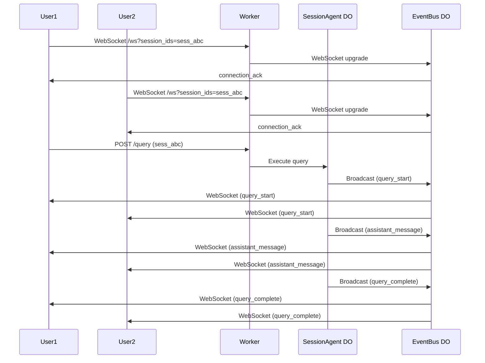

# Cloudflare + Modal Hybrid Architecture

This document describes the hybrid architecture using Cloudflare Workers + Durable Objects as the control plane with Modal as the execution backend.

## High-Level Architecture



## Component Responsibilities

### Cloudflare Layer (Control Plane)

#### 1. Worker (API Gateway)

**Purpose:** Primary API entry point and request routing

**Responsibilities:**

- Authenticate incoming requests (Bearer tokens, API keys, JWT)
- Route requests to appropriate Durable Objects
- Proxy job/artifact requests to Modal backend
- Handle CORS and security headers
- Rate limiting (via KV)

**Endpoints:**

- `POST /query` - Route to SessionAgent DO
- `POST /query_stream` - WebSocket upgrade to SessionAgent DO
- `POST /submit` - Forward to Modal job queue
- `GET /jobs/{id}` - Proxy to Modal backend
- `GET /session/{id}/*` - Route to SessionAgent DO
- `WebSocket /ws` - Connect to EventBus DO

**Scalability:**

- Stateless, auto-scales globally
- ~50ms cold start
- No connection state (delegated to DOs)

---

#### 2. SessionAgent Durable Object

**Purpose:** Per-session state management and orchestration

**Responsibilities:**

- Maintain session metadata (user, status, prompts)
- Store message history in durable SQLite
- Manage prompt queue for sequential processing
- Forward queries to Modal backend
- Bridge Modal SSE → WebSocket for streaming
- Broadcast updates to EventBus DO
- Handle session stop/cancel requests

**Durable Storage (SQLite):**

```sql
-- Session metadata
session_metadata (key, value)

-- Message history
messages (id, role, content, created_at)

-- Prompt queue
prompt_queue (id, question, agent_type, queued_at, priority)

-- Execution state
execution_state (key, value, updated_at)
```

**Lifecycle:**

- One DO per `session_id`
- Persists indefinitely (until explicitly deleted)
- Hibernates when no active connections
- Wakes on HTTP request or WebSocket message

**Scalability:**

- ~1,000 concurrent WebSocket connections per DO
- Automatic geographic distribution
- Strong consistency within DO

---

#### 3. EventBus Durable Object

**Purpose:** Real-time event fan-out and presence tracking

**Responsibilities:**

- Accept WebSocket connections from clients
- Tag connections by user, tenant, session IDs
- Broadcast events from SessionAgent DOs
- Filter events based on subscriptions
- Track user presence (who's online)
- Clean up stale connections (via alarms)

**Durable Storage:**

```typescript
{
  "connections": {
    "conn-uuid": {
      "connection_id": "conn-uuid",
      "user_id": "user-123",
      "session_ids": ["sess_abc", "sess_def"],
      "connected_at": 1234567890000,
      "last_ping_at": 1234567895000
    }
  }
}
```

**Lifecycle:**

- One DO per `tenant_id` or `user_id`
- Persists connection metadata across hibernation
- Alarm-based cleanup every 1 minute

**Scalability:**

- ~10,000 concurrent WebSocket connections per DO
- Supports multiplayer sessions
- Real-time updates (<100ms latency)

---

#### 4. KV Namespace

**Purpose:** Edge caching and rate limiting

**Responsibilities:**

- Cache `session_key` → `session_id` mappings (TTL: 24h)
- Rate limit counters (per user/IP)
- API key → user context lookups
- Pre-warm correlation IDs

**Example Keys:**

- `skey:user-123-session` → `sess_abc123`
- `ratelimit:user-123:1234567` → `42`
- `apikey:sk_live_abc` → `{"user_id": "user-123", ...}`

**TTLs:**

- Session keys: 24 hours
- Rate limits: 1 minute (rolling window)
- API keys: No expiration (manual invalidation)

---

### Modal Layer (Execution Backend)

#### 5. Modal Sandbox Manager

**Purpose:** Sandbox lifecycle management

**Responsibilities:**

- Create/discover sandboxes by name
- Generate encrypted tunnel URLs
- Health check monitoring
- Warm pool management (optional)
- Volume mounting and commits

**Key Functions:**

- `get_or_start_background_sandbox()` - Get/create sandbox
- `claim_warm_sandbox()` - Claim from pre-warm pool
- `sandbox.tunnels()` - Discover tunnel URLs
- `sandbox.poll()` - Check sandbox status

---

#### 6. Modal Sandbox (Agent Execution)

**Purpose:** Isolated agent execution environment

**Components:**

- **Controller (FastAPI)**: HTTP service on port 8001
- **Claude Agent SDK**: Agent runtime and MCP client
- **MCP Tools**: Read, Write, WebSearch, etc.

**Endpoints (controller.py):**

- `GET /health_check` - Liveness probe
- `POST /query` - Execute agent query (sync)
- `POST /query_stream` - Execute agent query (SSE)
- `POST /session/{id}/stop` - Stop execution

**Lifecycle:**

- Timeout: 24 hours max
- Idle timeout: 10 minutes
- Auto-restart on crash
- Persistent volume at `/data`

**Authentication:**

- Verify internal auth token from Cloudflare
- Optional: Modal Connect tokens

---

#### 7. Persistent Volume

**Purpose:** Workspace and artifact storage

**Structure:**

```
/data/
  jobs/
    {job-id}/
      workspace/
      artifacts/
  sessions/
    {session-id}/
      snapshots/
```

**Operations:**

- `volume.reload()` - Refresh before query (optional)
- `volume.commit()` - Persist after query (interval-based)

---

#### 8. Job Queue & Results

**Purpose:** Async job processing

**Components:**

- **JOB_QUEUE (Modal Queue)**: Pending jobs
- **JOB_RESULTS (Modal Dict)**: Job status and results

**Workflow:**

1. Client → Cloudflare → Modal: Submit job
2. Modal: Enqueue to `JOB_QUEUE`
3. Worker: Poll queue, execute in sandbox
4. Worker: Store result in `JOB_RESULTS`
5. Optional: Webhook callback to client

**Status Transitions:**

```
queued → running → complete/failed/canceled
```

---

## Request Flow Examples

### 1. Synchronous Query



---

### 2. Streaming Query (WebSocket)



---

### 3. Job Submission



---

### 4. Multiplayer Session



---

## Deployment Architecture

### Geographic Distribution

```
┌─────────────────────────────────────────────────────────────┐
│                    Cloudflare Global Network                 │
├─────────────────────────────────────────────────────────────┤
│                                                              │
│  North America          Europe              Asia Pacific     │
│  ┌──────────┐          ┌──────────┐        ┌──────────┐    │
│  │  Worker  │          │  Worker  │        │  Worker  │    │
│  │    DO    │          │    DO    │        │    DO    │    │
│  └──────────┘          └──────────┘        └──────────┘    │
│       │                     │                    │          │
└───────┼─────────────────────┼────────────────────┼──────────┘
        │                     │                    │
        └─────────────────────┼────────────────────┘
                              │
                    ┌─────────▼─────────┐
                    │   Modal Backend   │
                    │  (us-east-1 or    │
                    │   us-west-2)      │
                    └───────────────────┘
```

**Benefits:**

- Cloudflare Workers run at 300+ edge locations globally
- DOs automatically route to nearest location with state
- Modal backend centralized for consistent compute
- Latency: Edge → DO ~10ms, DO → Modal ~50-100ms

---

## Security Architecture

### Authentication Flow

```
┌─────────────────────────────────────────────────────────────┐
│                     Authentication Flow                      │
└─────────────────────────────────────────────────────────────┘

Client Token (Session Token / API Key / JWT)
    │
    ▼
┌──────────────────────────────────────────────┐
│ Cloudflare Worker                            │
│ - Validate token signature                   │
│ - Check expiration                           │
│ - Extract user_id, tenant_id, permissions    │
└──────────────────┬───────────────────────────┘
                   │ Context headers
                   ▼
┌──────────────────────────────────────────────┐
│ SessionAgent DO                              │
│ - Check session ownership                    │
│ - Verify permissions (read/write/stop)       │
│ - Generate internal auth token               │
└──────────────────┬───────────────────────────┘
                   │ Internal auth token (HMAC)
                   ▼
┌──────────────────────────────────────────────┐
│ Modal Backend                                │
│ - Verify internal token signature            │
│ - Check service = "cloudflare-worker"        │
│ - Check expiration (5 min TTL)               │
│ - Execute request                            │
└──────────────────────────────────────────────┘
```

### Security Boundaries

1. **Edge (Cloudflare):**

   - TLS termination
   - DDoS protection
   - Rate limiting
   - Bot detection

2. **Worker → DO:**

   - Same security boundary (Cloudflare platform)
   - Context passing via headers
   - No external network calls

3. **DO → Modal:**

   - HMAC-signed internal tokens
   - Short TTL (5 minutes)
   - IP allowlisting (optional)
   - Mutual TLS (optional)

4. **Modal → External APIs:**
   - API key/OAuth management
   - Secrets stored in Modal Secrets
   - Network policies (firewall)

---

## Scalability & Performance

### Metrics

| Component           | Latency    | Throughput | Concurrency        |
| ------------------- | ---------- | ---------- | ------------------ |
| **Worker**          | 10-50ms    | 100k req/s | Unlimited          |
| **SessionAgent DO** | 10-100ms   | 1k req/s   | 1k WS connections  |
| **EventBus DO**     | 10-50ms    | 10k msg/s  | 10k WS connections |
| **Modal Sandbox**   | 100-5000ms | 100 req/s  | 10 concurrent      |
| **KV Read**         | 1-10ms     | 100k req/s | Unlimited          |
| **KV Write**        | 10-100ms   | 10k req/s  | Unlimited          |

### Cost Estimates (Per Million Requests)

**Cloudflare:**

- Worker requests: $0.50
- DO requests: $0.15
- DO duration: $12.50/GB-hour (hibernation reduces this)
- KV reads: $0.50
- KV writes: $5.00

**Modal:**

- Sandbox (CPU): $0.00008/sec = $0.29/hour
- Sandbox (GPU optional): $1-4/hour
- Volume storage: $0.10/GB-month
- Volume I/O: Included

**Estimated Total (1M requests, avg 2s execution):**

- Cloudflare: ~$15-20
- Modal: ~$160 (compute only)
- **Total: ~$175-180 per million requests**

---

## Migration Strategy

### Phase 1: Parallel Deployment (Week 1-2)

- Deploy Cloudflare Worker + DOs alongside existing Modal gateway
- Route 10% of traffic to Cloudflare (by user ID hash)
- Monitor metrics (latency, errors, WebSocket stability)
- Keep Modal gateway as fallback

**Rollback Plan:**

- Feature flag to route back to Modal
- DNS switch if Worker is down

---

### Phase 2: Feature Rollout (Week 3-6)

- Increase Cloudflare traffic: 10% → 25% → 50%
- Enable WebSocket streaming for Cloudflare users
- Enable multiplayer sessions (EventBus DO)
- Migrate active sessions to DO storage

**Key Metrics:**

- P99 latency < 10s (query execution)
- WebSocket connection success rate > 99%
- DO error rate < 0.1%
- Session state consistency checks

---

### Phase 3: Full Cutover (Week 7-8)

- Route 100% traffic to Cloudflare
- Deprecate Modal `@modal.asgi_app()` gateway
- Keep Modal backend for execution only
- Archive old deployment configs

**Cleanup:**

- Remove Modal gateway code (`agent_sandbox/app.py:http_app`)
- Remove Modal Dicts for session state (`SESSION_STORE`, `PROMPT_QUEUE`)
- Update all documentation
- Announce to users

---

### Phase 4: Optimization (Ongoing)

- Tune DO storage usage (archive old sessions)
- Optimize WebSocket message batching
- Add caching layers (KV for frequent queries)
- Monitor costs and scale accordingly

---

## Monitoring & Observability

### Dashboards

**Cloudflare Analytics:**

- Request volume by endpoint
- P50/P95/P99 latency
- Error rate by status code
- WebSocket connection count
- DO invocation count and duration
- KV operation count

**Modal Metrics:**

- Sandbox utilization (count, CPU, memory)
- Query execution time (agent SDK)
- Volume I/O operations
- Job queue depth and throughput

**Combined View:**

- End-to-end latency (Client → Cloudflare → Modal → Response)
- Error rate by component
- Cost per request
- User satisfaction metrics

### Logging

**Structured Logging:**

```typescript
// Cloudflare Worker
console.log(
  JSON.stringify({
    timestamp: Date.now(),
    level: "info",
    service: "cloudflare-worker",
    event: "query_start",
    session_id: sessionId,
    user_id: userId,
    latency_ms: latency,
  })
);
```

```python
# Modal Backend
logger.info(
    "query_execution",
    extra={
        "timestamp": time.time(),
        "service": "modal-backend",
        "session_id": session_id,
        "user_id": user_id,
        "agent_type": agent_type,
        "duration_ms": duration_ms
    }
)
```

### Alerts

- **P99 latency > 10s** (5 min window) → Page on-call
- **Error rate > 1%** (1 min window) → Alert Slack
- **WebSocket disconnect rate > 10%** (5 min window) → Investigate
- **DO error rate > 0.1%** (1 min window) → Alert Slack
- **Modal sandbox unavailable** → Page immediately
- **Cost anomaly** (>2x daily average) → Alert finance team

---

## Benefits of Hybrid Architecture

### 1. Session Persistence

- Sessions survive sandbox restarts
- Message history stored durably in DO SQLite
- Seamless session resumption across requests

### 2. Real-time Multiplayer

- Multiple users can join same session
- Live updates via EventBus DO
- Presence tracking (who's online)
- Sub-100ms notification latency

### 3. Edge Performance

- Cloudflare Workers at 300+ locations globally
- DOs route to nearest location with state
- ~10-50ms latency for session state access
- WebSocket connections stay at edge

### 4. Separation of Concerns

- Cloudflare: Session state, routing, WebSockets
- Modal: Agent execution, filesystem, compute
- Clear ownership and scalability limits

### 5. Cost Optimization

- DO hibernation reduces idle costs
- Modal only pays for active compute
- KV caching reduces DO invocations
- Granular scaling per component

### 6. Developer Experience

- Single API surface (Cloudflare Worker)
- Same request/response schemas
- WebSocket-first for streaming
- Easy to add new clients (Web, Mobile, CLI)

---

## Trade-offs & Considerations

### Added Complexity

- Two infrastructure providers (Cloudflare + Modal)
- More deployment steps and secrets
- Distributed state management
- Potential for network issues between providers

### Cost

- Cloudflare adds ~10-15% overhead per request
- DO storage costs for high session volumes
- Need to monitor and optimize both platforms

### Debugging

- Logs split across Cloudflare and Modal
- Need correlation IDs (trace_id)
- Distributed tracing more complex

### Vendor Lock-in

- Cloudflare Durable Objects are proprietary
- Migration to another edge provider requires rewrite
- Modal abstraction makes compute portable

### Latency

- Extra hop: Cloudflare → Modal adds ~50-100ms
- Worth it for session persistence and WebSockets
- Can optimize with connection pooling

---

## Future Enhancements

### Short-term (3-6 months)

- [ ] Add caching layer (KV for frequent queries)
- [ ] Implement rate limiting per user/tenant
- [ ] Add presence tracking UI (who's editing)
- [ ] Support voice input/output (WebRTC)
- [ ] Mobile SDKs (iOS, Android)

### Long-term (6-12 months)

- [ ] Native Modal WebSocket support (remove SSE bridge)
- [ ] Collaborative editing (CRDT for session state)
- [ ] Session forking/branching (explore alternatives)
- [ ] AI-powered session summaries
- [ ] Analytics dashboard for usage patterns
